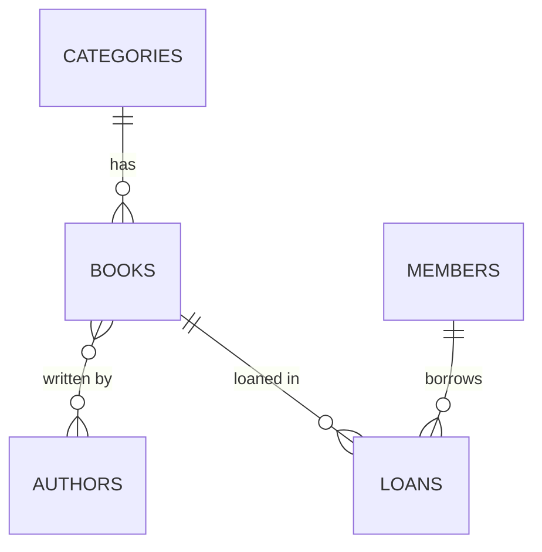

# Perpustakaan - Library Management REST API

A small library management backend built with Spring Boot. It keeps track of books, authors, categories, members, and loans, and enforces one business rule: **a book that is currently on loan cannot be borrowed again until it is returned.**

Built as a hands-on project to practice relational modeling (one-to-many, many-to-many, a join entity with extra columns), REST API design, unit testing, and containerization.

## Tech stack

- Java 17, Spring Boot 4, Spring Data JPA (Hibernate)
- PostgreSQL 16
- Docker and Docker Compose
- JUnit 5 and Mockito
- Maven

## Data model



- `books` belong to one `category` and can have many `authors` (join table `book_authors`).
- `loans` connect a `member` to a `book` and carry their own data: loan date, due date, and return date. A loan with no return date is still active.

## Business rules

- A book can only have one active loan at a time. This is checked in `LoanService` and also enforced by a partial unique index in PostgreSQL.
- A loan is due 14 days after it is created.
- A loan counts as `TELAT` (late) when it is past its due date and not yet returned.
- Returning a book that was already returned is rejected.

## Run it

Requirements: Docker with Docker Compose.

```bash
docker compose up -d --build
```

The API is available at `http://localhost:8080`. Hibernate creates the tables on first start. Then load sample data and the loan rule index:

```bash
docker exec -i perpustakaan-db psql -U perpus -d perpustakaan < sql/seed.sql
```

Stop everything with `docker compose stop`. Do not use `docker compose down -v` unless you want to delete the data.

## API

| Method | Endpoint | Description |
| --- | --- | --- |
| GET | `/books` | List all books with category and authors |
| GET | `/books/{id}` | Get one book |
| POST | `/books` | Add a book |
| GET | `/loans` | List all loans with status |
| POST | `/loans` | Borrow a book |
| PUT | `/loans/{id}/return` | Return a book |

Errors come back as JSON, for example `{"status":409,"message":"Buku sedang dipinjam: Clean Code"}`.

### Examples

```bash
# list books
curl -s http://localhost:8080/books

# add a book (use real category and author ids from your database)
curl -s -X POST http://localhost:8080/books \
  -H "Content-Type: application/json" \
  -d '{"title":"Refactoring","isbn":"9780134757599","publicationYear":2018,"categoryId":2,"authorIds":[3]}'

# borrow a book
curl -s -X POST http://localhost:8080/loans \
  -H "Content-Type: application/json" \
  -d '{"memberId":1,"bookId":1}'

# return a loan
curl -s -X PUT http://localhost:8080/loans/1/return
```

## Tests

Unit tests for the loan rules run without a database:

```bash
./mvnw test -Dtest=LoanServiceTest
```

Running `./mvnw test` also runs the Spring context test, which needs PostgreSQL running (`docker compose up -d db`).

## Project structure

```
src/main/java/com/vanxx/library
  controller   REST endpoints
  service      business rules
  repository   Spring Data JPA repositories
  entity       JPA entities
  dto          request and response objects
  exception    JSON error handling
sql/seed.sql   sample data and the active-loan index
```
